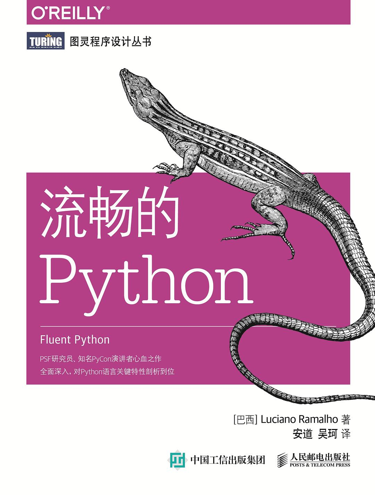
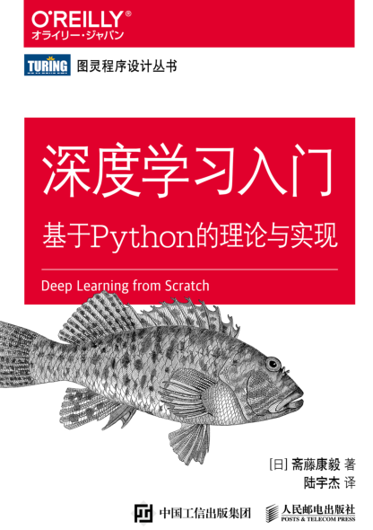
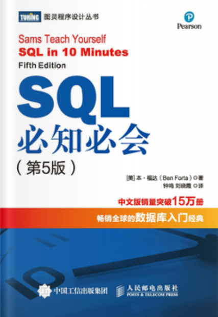

# IT-BookNotes

一些计算机书籍的代码或者笔记，包括《动手学深度学习（Pytorch版本）》《深度学习入门：基于Python的理论与实现》等，更新中

## 目录

| 书名  |类型   | 封面                   | 进度                 |
| ----------|----- | --------- | --------- |
| 动手学深度学习Pytorch版本| 代码+注释+部分课后题|  | 正在进行 |
| 流畅的Python | 代码 |  | 正在进行 |
| 深度学习入门：基于Python的理论与实现 | 代码 |  | 2024-04-23 已完成 |
| SQL必知必会（第五版）  |  代码     |  | 2024-03-03 已完成 |

## 更新记录

#### 动手学深度学习：Pytorch版【暂停更新】

| 章节  |  代码-完成时间  | 注释-完成时间 | 部分课后题-完成时间|
| ------ | ------- | ----- | ----- |
| 1. 引言   | 2024-04-24  | 2024-04-24 | 2024-04-24 |
| 2. 预备知识   | 2024-04-25  | 2024-05-02 | 2024-05-02 |
| 3. 线性神经网络   | 2024-04-26  | 2024-05-02 | 2024-05-02 |
| 4. 多层感知机   | 2024-04-26  | 2024-05-04 | 2024-05-04 |
| 5. 深度学习计算   | 2024-04-27  | 2024-05-04 | 2024-05-04 |
| 6. 卷积神经网络   | 2024-04-28  | 2024-05-04 | 2024-05-05 |
| *7. 现代卷积神经网络   |  2024-04-29  | 2024-05-06 | - |
| 8. 循环神经网络   | 2024-05-09 | - | - |
| 9. 现代循环神经网络   | 2024-05-11 | - | - |
| 10. 注意力机制   | 2024-05-17 | - | - |
| 11. 优化算法   | 2024-05-09 | - | - |
| *12. 计算性能   | 2024-05-08 | - | - |
| 13. 计算机视觉   | 2024-05-06 | - | - |

注：
1. 带星号的章节是由于客观条件没能完成，会在有条件之后择日完成。
2. 14、15章目前用不到，暂时不考虑学习。
3. 初期版本简陋，建议直接看官方的库和实现，后续会随着我的学习不断更新。

#### 流畅的Python

| 章节  |  完成时间  |
| ------ | ------- | 
|第1章 Python数据模型 | 2024-05-17 |
|第2章 序列构成的数组 | 2024-05-18 |
|第3章 字典和集合 | - |
|第4章 文本和字节序列 | - |
|第5章 一等函数 | - |
|第6章 使用一等函数实现设计模式 | - |
|第7章 函数装饰器和闭包 | - |
|第8章 对象引用、可变性和垃圾回收 | - |
|第9章 符合Python风格的对象 | - |
|第10章 序列的修改、散列和切片 | - |
|第11章 接口：从协议到抽象基类 | - |
|第12章 继承的优缺点 | - |
|第13章 正确重载运算符 | - |
|第14章 可迭代的对象、选代器和生成器 | - |
|第15章 上下文管理器和else块 | - |
|第16章 协程 | - |
|第17章 使用future处理并发 | - |
|第18章 使用asyncio包处理并发 | - |
|第19章 动态属性和特性 | - |
|第20章 属性描述符 | - |
|第21章 类元编程 | - |

#### 深度学习入门：基于Python的理论与实现

| 章节                   | 代码-完成时间   | 注释-完成时间 |
| ---------------------- | ---------- |---------- |
| 第1章 Python入门       | 2024-02-28 |  |
| 第2章 感知机           |  2024-02-29  |  |
| 第3章 神经网络         | 2024-03-05 |  |
| 第4章 神经网络的学习   | 2024-04-07 |  |
| 第5章 误差反向传播法   | 2024-04-09 |  |
| 第6章 与学习相关的技巧 | 2024-04-23 |  |
| 第7章 卷积神经网络     | 2024-04-23 |  |
| 第8章 深度学习         | 2024-04-23 |  |

#### SQL必知必会（第五版）

| 章节                   | 完成时间   |
| ---------------------- | ---------- |
| 第1课 了解SQL          | 2024-03-01 |
| 第2课 检索数据         | 2024-03-01 |
| 第3课 排序检索数据     | 2024-03-01 |
| 第4课 过滤数据         | 2024-03-01 |
| 第5课 高级数据过滤     | 2024-03-02 |
| 第6课 用通配符进行过滤 | 2024-03-02 |
| 第7课 创建计算字段     | 2024-03-02 |
| 第8课 使用函数处理数据 | 2024-03-02 |
| 第9课 汇总数据         | 2024-03-02 |
| 第10课 分组数据        | 2024-03-02 |
| 第11课 使用子查询      | 2024-03-02 |
| 第12课 联结表          | 2024-03-03 |
| 第13课 创建高级联结    | 2024-03-03 |
| 第14课 组合查询        | 2024-03-03 |
| 第15课 插入数据        | 2024-03-03 |
| 第16课 更新和删除数据  | 2024-03-03 |
| 第17课 创建和操纵表    | 2024-03-03 |
| 第18课 使用视图        | 2024-03-03 |
| 第19课 使用存储过程    | 2024-03-03 |
| 第20课 管理事务处理    | 2024-03-03 |
| 第21课 使用游标        | 2024-03-03 |
| 第22课 高级SQL特性     | 2024-03-03 |
