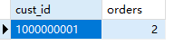
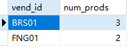

## 10.3 过滤分组

```sql
SELECT
	cust_id,
	count(*) AS orders 
FROM
	orders 
GROUP BY
	cust_id 
HAVING
	count(*) >= 2
```

> 

```sql
SELECT
	vend_id,
	count(*) AS num_prods 
FROM
	products 
WHERE
	prod_price >= 4 
GROUP BY
	vend_id 
HAVING
	count(*) >= 2
```

> 
