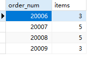
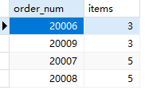

## 10.4 分组和排序

```sql
SELECT
	order_num,
	count(*) AS items 
FROM
	orderitems 
GROUP BY
	order_num 
HAVING
	count(*) >= 3
```

> 

```sql
SELECT
	order_num,
	count(*) AS items 
FROM
	orderitems 
GROUP BY
	order_num 
HAVING
	count(*) >= 3 
ORDER BY
	items
```

> 
