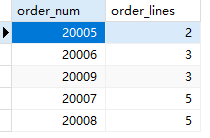
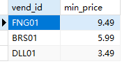
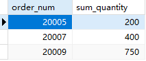
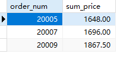
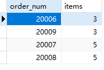

## 10.7 挑战题

1．OrderItems表包含每个订单的每个产品。编写SQL语句，返回每个订单号（order_num）各有多少行数（order_lines），并按order_lines对结果进行排序。

```sql
SELECT
	order_num,
	count(*) AS order_lines 
FROM
	orderitems 
GROUP BY
	order_num 
ORDER BY
	order_lines
```

> 

2．编写SQL语句，返回名为cheapest_item的字段，该字段包含每个供应商成本最低的产品（使用Products表中的prod_price），然后从最低成本到最高成本对结果进行排序。

```sql
SELECT
	vend_id,
	min( prod_price ) AS min_price 
FROM
	products 
GROUP BY
	vend_id 
ORDER BY
	min_price DESC
```

> 

3．确定最佳顾客非常重要，请编写SQL语句，返回至少含100项的所有订单的订单号（OrderItems表中的order_num）。

```sql
SELECT
	order_num,
	sum( quantity ) sum_quantity 
FROM
	orderitems 
GROUP BY
	order_num 
HAVING
	sum( quantity ) >= 100
```

> 

4．确定最佳顾客的另一种方式是看他们花了多少钱。编写SQL语句，返回总价至少为1000的所有订单的订单号（OrderItems表中的order_num）。提示：需要计算总和（item_price乘以quantity）。按订单号对结果进行排序。

```sql
SELECT
	order_num,
	sum( quantity * item_price ) sum_price 
FROM
	orderitems 
GROUP BY
	order_num 
HAVING
	sum( quantity * item_price ) >= 1000
```

> 

5．下面的SQL语句有问题吗？（尝试在不运行的情况下指出。）

```sql
SELECT order_num, COUNT(＊) AS items
FROM OrderItems
GROUP BY items
HAVING COUNT(＊) >= 3
ORDER BY items, order_num;
```

不能用`count(\*)`

改正后：

```sql
SELECT
	order_num,
	COUNT( order_num ) AS items 
FROM
	orderitems 
GROUP BY
	order_num 
HAVING
	COUNT( order_num ) >= 3 
ORDER BY
	items,
	order_num;
```

> 
