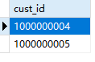
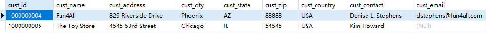

## 11.2 利用子查询进行过滤

```sql
SELECT
	cust_id 
FROM
	orders 
WHERE
	order_num IN (
	SELECT order_num 
	FROM orderitems 
WHERE prod_id = 'RGAN01'
)
```

> 


```sql
SELECT * FROM customers 
WHERE
	cust_id IN (
	SELECT cust_id 
	FROM orders 
	WHERE order_num IN ( 
		SELECT order_num 
		FROM orderitems 
		WHERE prod_id = 'RGAN01' 
))
```

> 


