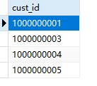
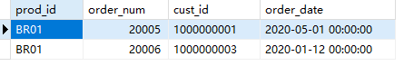
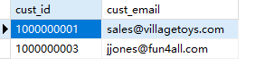
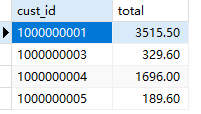
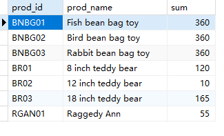

## 11.5 挑战题

1．使用子查询，返回购买价格为10美元或以上产品的顾客列表。你需要使用OrderItems表查找匹配的订单号（order_num），然后使用Order表检索这些匹配订单的顾客ID（cust_id）。

```sql
SELECT
	orders.cust_id 
FROM
	orders,
	( SELECT order_num, item_price FROM orderitems WHERE item_price > 10 ) t 
WHERE
	orders.order_num = t.order_num
```

> 

2．你想知道订购BR01产品的日期。编写SQL语句，使用子查询来确定哪些订单（在OrderItems中）购买了prod_id为BR01的产品，然后从Orders表中返回每个产品对应的顾客ID（cust_id）和订单日期（order_date）。按订购日期对结果进行排序。

```sql
SELECT
	oi.prod_id,
	o.order_num,
	o.cust_id,
	o.order_date 
FROM
	orders o,
	( SELECT prod_id, order_num FROM orderitems WHERE prod_id = 'BR01' ) oi 
WHERE
	o.order_num = oi.order_num
```

> 

3．现在我们让它更具挑战性。在上一个挑战题，返回购买prod_id为BR01的产品的所有顾客的电子邮件（Customers表中的cust_email）。提示：这涉及SELECT语句，最内层的从OrderItems表返回order_num，中间的从Customers表返回cust_id。

```sql
SELECT
	c.cust_id,
	c.cust_email 
FROM
	customers c,(
	SELECT
		o.cust_id 
	FROM
		orders o,
		( SELECT prod_id, order_num FROM orderitems WHERE prod_id = 'BR01' ) oi 
	WHERE
		o.order_num = oi.order_num 
	) t 
WHERE
	c.cust_id = t.cust_id;
```

> 

4．我们需要一个顾客ID列表，其中包含他们已订购的总金额。编写SQL语句，返回顾客ID（Orders表中的cust_id），并使用子查询返回total_ordered以便返回每个顾客的订单总数。将结果按金额从大到小排序。提示：你之前已经使用SUM()计算订单总数。

版本1

```sql
SELECT
	o.cust_id,
	sum( ot.order_total ) total 
FROM
	orders o,(
	SELECT
		order_num,
		sum( quantity * item_price ) order_total 
	FROM
		orderitems 
	GROUP BY
		order_num 
	) ot 
WHERE
	o.order_num = ot.order_num 
GROUP BY
	o.cust_id
```

> 

5．再来。编写SQL语句，从Products表中检索所有的产品名称（prod_name），以及名为quant_sold的计算列，其中包含所售产品的总数（在OrderItems表上使用子查询和SUM(quantity)检索）。

```sql
SELECT
	p.prod_id,
	p.prod_name,
	q.sum 
FROM
	products p,
	( SELECT prod_id, sum( quantity ) sum FROM orderitems GROUP BY prod_id ) q 
WHERE
	p.prod_id = q.prod_id
```

> 


