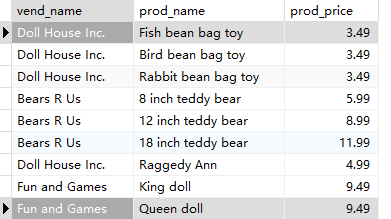
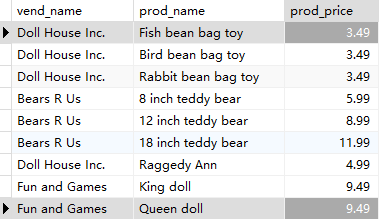
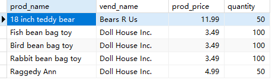
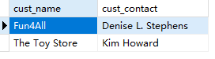

## 12.2 创建联结

笛卡尔积过滤

```sql
SELECT
	vend_name,
	prod_name,
	prod_price 
FROM
	vendors,
	products 
WHERE
	vendors.vend_id = products.vend_id
```

> 

内联结

```sql
SELECT
	vend_name,
	prod_name,
	prod_price 
FROM
	vendors
	INNER JOIN products ON vendors.vend_id = products.vend_id
```

> 

```sql
SELECT
	prod_name,
	vend_name,
	prod_price,
	quantity 
FROM
	OrderItems,
	Products,
	Vendors 
WHERE
	Products.vend_id = Vendors.vend_id 
	AND OrderItems.prod_id = Products.prod_id 
	AND order_num = 20007;
```

> 

```sql
SELECT
	cust_name,
	cust_contact 
FROM
	customers 
WHERE
	cust_id IN (
	SELECT
		cust_id 
	FROM
		orders 
	WHERE
	order_num IN ( SELECT order_num FROM orderitems WHERE prod_id = 'RGAN01' ) 
	)
```

> 
