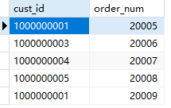
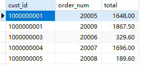
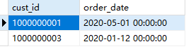
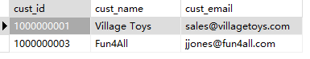
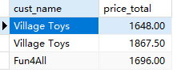

## 12.4 挑战题

1．编写SQL语句，返回Customers表中的顾客名称（cust_name）和Orders表中的相关订单号（order_num），并按顾客名称再按订单号对结果进行排序。实际上是尝试两次，一次使用简单的等联结语法，一次使用INNER JOIN。

简单的全联结后筛选

```sql
SELECT c.cust_id, o.order_num
FROM customers c, orders o
WHERE c.cust_id = o.cust_id
ORDER BY o.order_num;
```

内联结

```sql
SELECT c.cust_id, o.order_num
FROM customers c
INNER JOIN orders o
ON c.cust_id=o.cust_id
ORDER BY o.order_num;
```

> 


2．我们来让上一题变得更有用些。除了返回顾客名称和订单号，添加第三列OrderTotal，其中包含每个订单的总价。有两种方法可以执行此操作：使用OrderItems表的子查询来创建OrderTotal列，或者将OrderItems表与现有表联结并使用聚合函数。提示：请注意需要使用完全限定列名的地方。

```sql
SELECT c.cust_id, o.order_num, t.total
FROM customers c
INNER JOIN orders o
ON c.cust_id=o.cust_id
INNER JOIN (
	SELECT order_num, sum(quantity * item_price) total
	FROM orderitems
	GROUP BY order_num
) t 
ON o.order_num = t.order_num;
```

> 

3．我们重新看一下第11课的挑战题2。编写SQL语句，检索订购产品BR01的日期，这一次使用联结和简单的等联结语法。输出应该与第11课的输出相同。

```sql
SELECT o.cust_id, o.order_date
FROM orders o
INNER JOIN (
	SELECT order_num
	FROM orderitems
	WHERE prod_id='BR01'
) t
ON o.order_num=t.order_num
```

> 

4．很有趣，我们再试一次。重新创建为第11课挑战题3编写的SQL语句，这次使用ANSI的INNER JOIN语法。在之前编写的代码中使用了两个嵌套的子查询。要重新创建它，需要两个INNER JOIN语句，每个语句的格式类似于本课讲到的INNER JOIN示例，而且不要忘记WHERE子句可以通过prod_id进行过滤。

```sql
SELECT c.cust_id, c.cust_name, c.cust_email
FROM customers c
INNER JOIN(
	SELECT o.cust_id
	FROM orders o
	INNER JOIN (
		SELECT order_num
		FROM orderitems
		WHERE prod_id='BR01'
	) t
	ON o.order_num=t.order_num
) t1
ON t1.cust_id=c.cust_id;
```

> 

5．再让事情变得更加有趣些，我们将混合使用联结、聚合函数和分组。准备好了吗？回到第10课，当时的挑战是要求查找值等于或大于1000的所有订单号。这些结果很有用，但更有用的是订单数量至少达到这个数的顾客名称。因此，编写SQL语句，使用联结从Customers表返回顾客名称（cust_name），并从OrderItems表返回所有订单的总价。

> 提示：要联结这些表，还需要包括Orders表（因为Customers表与OrderItems表不直接相关，Customers表与Orders表相关，而Orders表与OrderItems表相关）。不要忘记GROUP BY和HAVING，并按顾客名称对结果进行排序。你可以使用简单的等联结或ANSI的INNER JOIN语法。或者，如果你很勇敢，请尝试使用两种方式编写。

全联结

```sql
SELECT c.cust_name, t.price_total
FROM customers c, (
	SELECT o.cust_id, pt.price_total
	FROM orders o, (
		SELECT order_num, sum(quantity * item_price) price_total
		FROM orderitems
		GROUP BY order_num
		HAVING price_total > 1000
	) pt
	WHERE o.order_num=pt.order_num
) t
WHERE t.cust_id=c.cust_id;
```

内联结

```sql
SELECT c.cust_name, t.price_total
FROM customers c
INNER JOIN (
	SELECT o.cust_id, pt.price_total
	FROM orders o
	INNER JOIN (
		SELECT order_num, sum(quantity * item_price) price_total
		FROM orderitems
		GROUP BY order_num
		HAVING price_total > 1000
	) pt
	ON o.order_num=pt.order_num
) t
ON t.cust_id=c.cust_id;
```

> 


