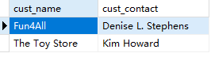

## 13.1 使用表别名

```sql
SELECT
	cust_name,
	cust_contact 
FROM
	Customers AS C,
	Orders AS O,
	OrderItems AS OI 
WHERE
	C.cust_id = O.cust_id 
	AND OI.order_num = O.order_num 
	AND prod_id = 'RGAN01';
```

> 
