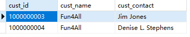
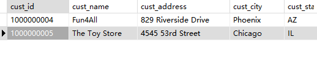
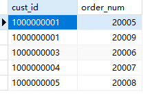
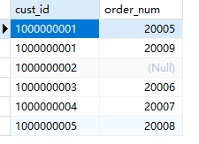
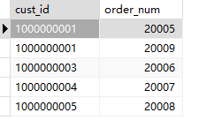

## 13.2 使用不同类型的联结

```sql
SELECT cust_id, cust_name, cust_contact
FROM customers
WHERE cust_name = (
	SELECT cust_name
	FROM customers
	WHERE cust_contact='Jim Jones'
)
```

```sql
SELECT c1.cust_id, c1.cust_name, c1.cust_contact
FROM Customers AS c1, Customers AS c2
WHERE c1.cust_name = c2.cust_name
	AND c2.cust_contact = 'Jim Jones';
```

> 

```sql
SELECT
	c.*,
	o.order_num,
	o.order_date,
	oi.prod_id,
	oi.quantity,
	oi.item_price 
FROM
	customers c,
	orders o,
	orderitems oi 
WHERE
	c.cust_id = o.cust_id 
	AND oi.order_num = o.order_num 
	AND prod_id = 'RGAN01'
```



外联结

```sql
SELECT customers.cust_id, orders.order_num
FROM customers
INNER JOIN orders
ON customers.cust_id=orders.cust_id
```

> 

左联结

```sql
SELECT customers.cust_id, orders.order_num
FROM customers
LEFT JOIN orders
ON customers.cust_id=orders.cust_id
```

> 

右联结

```sql
SELECT c.cust_id, o.order_num
FROM customers c
RIGHT JOIN orders o
ON c.cust_id=o.cust_id
```

> 
