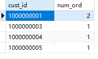
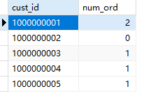

## 13.3 使用带聚集函数的联结

```sql
SELECT c.cust_id, count(o.order_num) as num_ord
FROM customers c
INNER JOIN orders o
ON c.cust_id=o.cust_id
GROUP BY c.cust_id
```

> 


```sql
SELECT c.cust_id, count(o.order_num) as num_ord
FROM customers c
LEFT JOIN orders o
ON c.cust_id=o.cust_id
GROUP BY c.cust_id
```

> 
