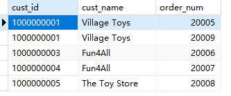
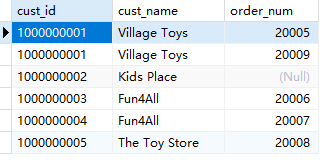
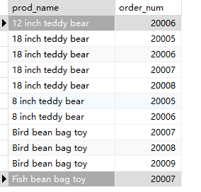
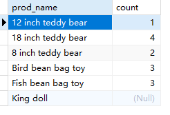
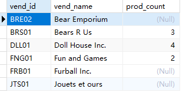

## 13.6 挑战题

1．使用INNER JOIN编写SQL语句，以检索每个顾客的名称（Customers表中的cust_name）和所有的订单号（Orders表中的order_num）。

```sql
SELECT c.cust_id, c.cust_name, o.order_num
FROM customers c
INNER JOIN orders o
ON c.cust_id = o.cust_id
```



2．修改刚刚创建的SQL语句，仅列出所有顾客，即使他们没有下过订单。

```sql
SELECT c.cust_id, c.cust_name, o.order_num
FROM customers c
LEFT JOIN orders o
ON c.cust_id = o.cust_id
```



3．使用OUTER JOIN联结Products表和OrderItems表，返回产品名称（prod_name）和与之相关的订单号（order_num）的列表，并按商品名称排序。

```sql
SELECT p.prod_name, oi.order_num
FROM products p
LEFT JOIN orderitems oi
ON p.prod_id=oi.prod_id
ORDER BY p.prod_name;
```



4．修改上一题中创建的SQL语句，使其返回每一项产品的总订单数（不是订单号）。

```sql
SELECT p.prod_name, oi.count
FROM products p
LEFT JOIN (
	SELECT prod_id, count(order_num) count
	FROM orderitems
	GROUP BY prod_id
	) oi
ON p.prod_id=oi.prod_id
ORDER BY p.prod_name;
```

> 

5．编写SQL语句，列出供应商（Vendors表中的vend_id）及其可供产品的数量，包括没有产品的供应商。你需要使用OUTER JOIN和COUNT()聚合函数来计算Products表中每种产品的数量。注意：vend_id列会显示在多个表中，因此在每次引用它时都需要完全限定它。

```sql
SELECT v.vend_id, v.vend_name, p.count prod_count
FROM vendors v
LEFT JOIN (
	SELECT vend_id, count(prod_id) count 
	FROM products
	GROUP BY vend_id
) p
ON v.vend_id=p.vend_id
```

> 

