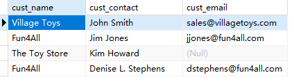
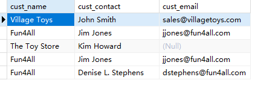

## 14.2 创建组合查询

不包含重复的

```sql
SELECT cust_name, cust_contact, cust_email
FROM Customers
WHERE cust_state IN ('IL','IN','MI')
UNION
SELECT cust_name, cust_contact, cust_email
FROM Customers
WHERE cust_name = 'Fun4All';
```

> 

包含重复的

```sql
SELECT cust_name, cust_contact, cust_email
FROM Customers
WHERE cust_state IN ('IL','IN','MI')
UNION ALL
SELECT cust_name, cust_contact, cust_email
FROM Customers
WHERE cust_name = 'Fun4All';
```

> 

排序

```sql
SELECT cust_name, cust_contact, cust_email
FROM Customers
WHERE cust_state IN ('IL','IN','MI')
UNION
SELECT cust_name, cust_contact, cust_email
FROM Customers
WHERE cust_name = 'Fun4All'
ORDER BY cust_name, cust_contact;
```

> 
