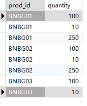
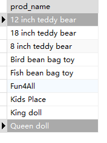

## 14.4 挑战题

1．编写SQL语句，将两个SELECT语句结合起来，以便从OrderItems表中检索产品ID（prod_id）和quantity。其中，一个SELECT语句过滤数量为100的行，另一个SELECT语句过滤ID以BNBG开头的产品。按产品ID对结果进行排序。

```sql
SELECT prod_id, quantity
FROM orderitems
WHERE quantity=100
UNION
SELECT prod_id, quantity
FROM orderitems
WHERE prod_id LIKE 'BNBG%'
ORDER BY prod_id
```

> 

2．重写刚刚创建的SQL语句，仅使用单个SELECT语句。

```sql
SELECT prod_id, quantity
FROM orderitems
WHERE quantity=100 OR prod_id LIKE 'BNBG%'
ORDER BY prod_id
```

> 


3．我知道这有点荒谬，但这节课中的一个注释提到过。编写SQL语句，组合Products表中的产品名称（prod_name）和Customers表中的顾客名称（cust_name）并返回，然后按产品名称对结果进行排序。

```sql
SELECT prod_name
FROM products
UNION
SELECT cust_name
FROM customers
ORDER BY prod_name
```

> 


4．下面的SQL语句有问题吗？（尝试在不运行的情况下指出。）

```sql
SELECT cust_name, cust_contact, cust_email
FROM Customers
WHERE cust_state = 'MI'
ORDER BY cust_name; -- 这里不能加分号
UNION
SELECT cust_name, cust_contact, cust_email
FROM Customers
WHERE cust_state = 'IL'
ORDER BY cust_name;
```
