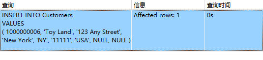

## 15.1 数据插入

```sql
INSERT INTO Customers
VALUES
	( 1000000006, 'Toy Land', '123 Any Street', 'New York', 'NY', '11111', 'USA', NULL, NULL );
```

```sql
INSERT INTO Customers ( cust_id, cust_contact, cust_email, cust_name, cust_address, cust_city, cust_state, cust_zip )
VALUES
	( 1000000006, NULL, NULL, 'Toy Land', '123 Any Street', 'New York', 'NY', '11111' );
```

> 

```sql
INSERT INTO Customers ( cust_id, cust_contact, cust_email, cust_name, cust_address, cust_city, cust_state, cust_zip, cust_country ) SELECT
cust_id,
cust_contact,
cust_email,
cust_name,
cust_address,
cust_city,
cust_state,
cust_zip,
cust_country 
FROM
	CustNew;
```

