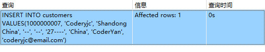
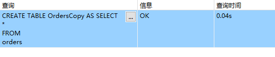
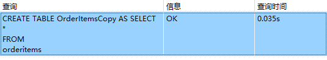

## 15.4挑战题

1．使用INSERT和指定的列，将你自己添加到Customers表中。明确列出要添加哪几列，且仅需列出你需要的列。

```sql
INSERT INTO customers
VALUES
	(
		1000000007,
		'Coderyjc',
		'Shandong China',
		'--',
		'--',
		'27----',
		'China',
		'CoderYan',
		'coderyjc@email.com')
```

> 

2．备份Orders表和OrderItems表。

```sql
CREATE TABLE OrdersCopy AS SELECT
* 
FROM
	orders
```

> 

```sql
CREATE TABLE OrderItemsCopy AS SELECT
* 
FROM
	orderitems
```

> 
