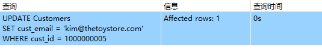
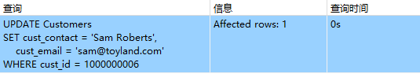
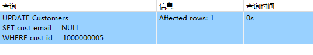

## 16.1 更新数据

```sql
UPDATE Customers
SET cust_email = 'kim@thetoystore.com'
WHERE cust_id = 1000000005;
```

> 

```sql
UPDATE Customers
SET cust_contact = 'Sam Roberts',
    cust_email = 'sam@toyland.com'
WHERE cust_id = 1000000006;
```

> 

```sql
UPDATE Customers
SET cust_email = NULL
WHERE cust_id = 1000000005;
```

> 
