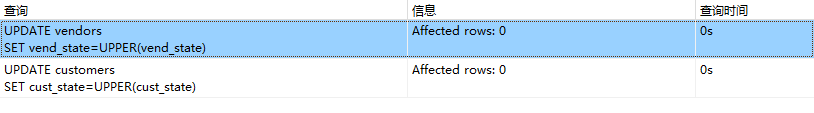
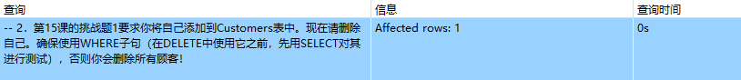

## 16.5挑战题

1．美国各州的缩写应始终用大写。编写SQL语句来更新所有美国地址，包括供应商状态（Vendors表中的vend_state）和顾客状态（Customers表中的cust_state），使它们均为大写。

```sql
UPDATE vendors
SET vend_state=UPPER(vend_state);
UPDATE customers
SET cust_state=UPPER(cust_state);
```

> 以前就是大写的
>
> 

2．第15课的挑战题1要求你将自己添加到Customers表中。现在请删除自己。确保使用WHERE子句（在DELETE中使用它之前，先用SELECT对其进行测试），否则你会删除所有顾客！

```sql
DELETE FROM customers WHERE cust_name='CDY';
```

> 
