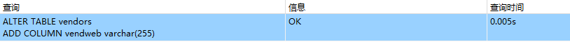
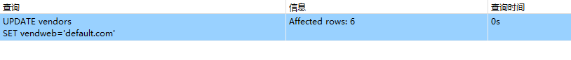

## 17.6 挑战题

1．在Vendors表中添加一个网站列（vend_web）。你需要一个足以容纳URL的大文本字段。

```sql
ALTER TABLE vendors
ADD COLUMN vendweb varchar(255)
```

> 

2．使用UPDATE语句更新Vendor记录，以便加入网站（你可以编造任何地址）。

```sql
UPDATE vendors
SET vendweb='default.com'
```


