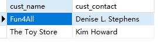

## 18.1视图

```sql
SELECT cust_name, cust_contact
FROM Customers, Orders, OrderItems
WHERE Customers.cust_id = Orders.cust_id
	AND OrderItems.order_num = Orders.order_num
	AND prod_id = 'RGAN01';
```

> 
