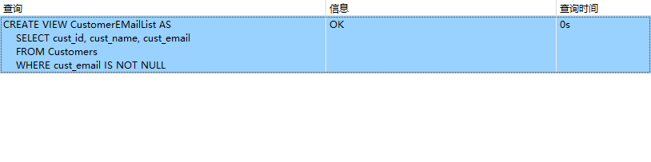

## 18.2 创建视图

```sql
CREATE VIEW ProductCustomers AS
SELECT cust_name, cust_contact, prod_id
FROM Customers, Orders, OrderItems
WHERE Customers.cust_id = Orders.cust_id
	AND OrderItems.order_num = Orders.order_num;
```

> 

```sql
SELECT cust_name, cust_contact
FROM ProductCustomers
WHERE prod_id='RGAN01'
```

> 

拼接

```sql
SELECT
	concat( RTRIM( vend_name ), '(', RTRIM( vend_country ), ')' ) AS vend_title 
FROM
	Vendors 
ORDER BY
	vend_name;
```

> 

过滤数据

```sql
CREATE VIEW CustomerEMailList AS
SELECT cust_id, cust_name, cust_email
FROM Customers
WHERE cust_email IS NOT NULL;
```

> 

```sql
SELECT * FROM CustomerEMailList;
```

> 

计算字段

```sql
SELECT
	prod_id,
	quantity,
	item_price,
	quantity*item_price AS expanded_price 
FROM
	OrderItems 
WHERE
	order_num = 20008;
```

```sql
CREATE VIEW OrderItemsExpanded AS SELECT
order_num,
prod_id,
quantity,
item_price,
quantity * item_price AS expanded_price 
FROM
	OrderItems
```

```sql
SELECT *
FROM OrderItemsExpanded
WHERE order_num = 20008;
```

> 
