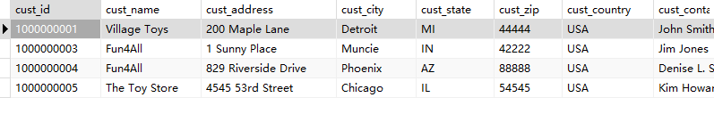

## 18.4 挑战题

1．创建一个名为CustomersWithOrders的视图，其中包含Customers表中的所有列，但仅仅是那些已下订单的列。提示：可以在Orders表上使用JOIN来仅仅过滤所需的顾客，然后使用SELECT来确保拥有正确的数据。

```sql
CREATE VIEW CustomersWithOrders AS SELECT
* 
FROM
	customers 
WHERE
	cust_id IN (
	SELECT DISTINCT
		cust_id 
    FROM orders);

SELECT * FROM CustomersWithOrders;
```

> 

2．下面的SQL语句有问题吗？（尝试在不运行的情况下指出。）

```sql
CREATE VIEW OrderItemsExpanded AS
SELECT order_num,
      prod_id,
      quantity,
      item_price,
      quantity＊item_price AS expanded_price
FROM OrderItems
ORDER BY order_num;
```

>在创建视图时，通常不允许包含ORDER BY子句。视图的目的是提供一种逻辑数据模型，而不涉及具体的数据排序。ORDER BY子句用于在查询结果中对数据进行排序，这应该是在使用视图的查询语句中的一个独立的步骤。
>
>因此，正确的做法是将ORDER BY子句从创建视图的语句中移除，并在需要排序的查询语句中使用它。