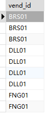
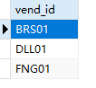
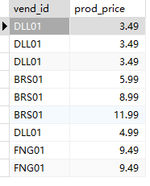
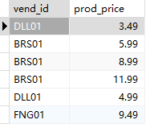

## 2.5 检索不同的值

### 没有使用DISTINCT

```sql
SELECT
	vend_id 
FROM
	products
```

> 

### 使用了DISTINCT

```sql
SELECT DISTINCT
	vend_id 
FROM
	products
```

> 

### 不能部分使用DISTINCT


```sql
SELECT
	vend_id,
	prod_price 
FROM
	Products;
```

> 

**DISTINCT关键字作用于所有的列，不仅仅是跟在其后的那一列。**

```sql
SELECT DISTINCT
	vend_id,
	prod_price 
FROM
	Products;
```

> 


