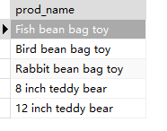
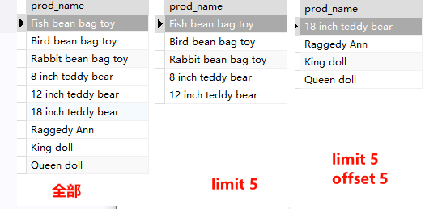

## 2.6.限制结果

SQL Server/DB2/Oracle/MySQL等各不相同，以下只展示MySQL的，后同。

```sql
SELECT
	prod_name 
FROM
	products 
	LIMIT 5 -- 第01234行
```

> 


```SQL
SELECT
	prod_name 
FROM
	products 
	LIMIT 5 OFFSET 5 -- 第56789行
```

> 


