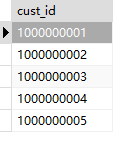
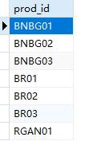
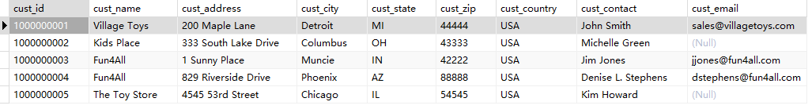

1．编写SQL语句，从Customers表中检索所有的ID（cust_id）。

```sql
SELECT
	cust_id 
FROM
	Customers;
```

> 

2．OrderItems表包含了所有已订购的产品（有些已被订购多次）。编写SQL语句，检索并列出已订购产品（prod_id）的清单（不用列每个订单，只列出不同产品的清单）。提示：最终应该显示7行。

```sql
SELECT DISTINCT
	prod_id 
FROM
	OrderItems
```

> 

3．编写SQL语句，检索Customers表中所有的列，再编写另外的SELECT语句，仅检索顾客的ID。使用注释，注释掉一条SELECT语句，以便运行另一条SELECT语句。（当然，要测试这两个语句。）

```sql
-- SELECT
-- 	* 
-- FROM
-- 	customers

SELECT
	cust_id 
FROM
	customers
```

> 


