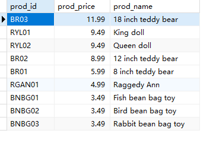
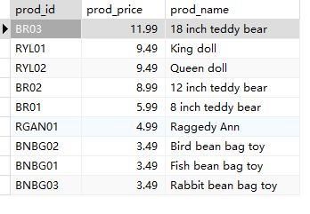

## 3.4 指定排序方向

价格降序

```sql
SELECT
	prod_id,
	prod_price,
	prod_name 
FROM
	products 
ORDER BY
	prod_price DESC
```

> 

价格降序，加上产品名

```sql
SELECT
	prod_id,
	prod_price,
	prod_name 
FROM
	products 
ORDER BY
	prod_price DESC, prod_name
```

>


