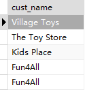
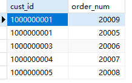
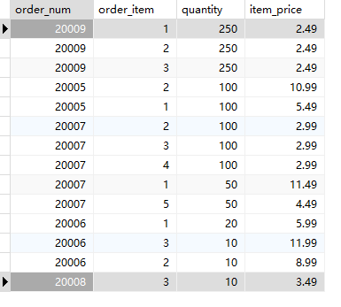

## 3.6 挑战题

1．编写SQL语句，从Customers中检索所有的顾客名称（cust_names），并按从Z到A的顺序显示结果。

```sql
SELECT
	cust_name 
FROM
	customers 
ORDER BY
	1 DESC
```

> 

2．编写SQL语句，从Orders表中检索顾客ID（cust_id）和订单号（order_num），并先按顾客ID对结果进行排序，再按订单日期倒序排列。

```sql
SELECT
	cust_id,
	order_num 
FROM
	orders 
ORDER BY
	cust_id,
	order_num DESC
```

> 

3．显然，我们的虚拟商店更喜欢出售比较贵的物品，而且这类物品有很多。编写SQL语句，显示OrderItems表中的数量和价格（item_price），并按数量由多到少、价格由高到低排序。

```sql
SELECT
	order_num,
	order_item,
	quantity,
	item_price 
FROM
	OrderItems 
ORDER BY
	quantity DESC,
	item_price DESC;
```



4．下面的SQL语句有问题吗？（尝试在不运行的情况下指出。）

```sql
SELECT vend_name,
FROM Vendors
ORDER vend_name DESC;
```

缺少了 `BY`