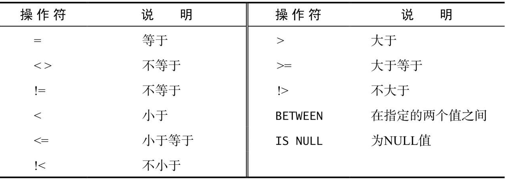
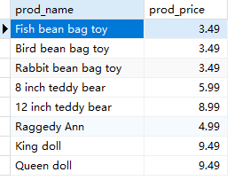
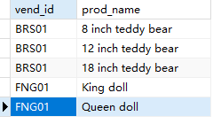
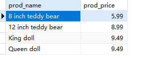
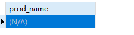
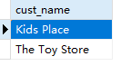

## 4.2 WHERE子句操作符



列出所有小于10美元的产品

```sql
SELECT
	prod_name,
	prod_price 
FROM
	products 
WHERE
	prod_price < 10 -- 小于等于10美元，就是把<换成 <=
```

> 

列出所有不是供应商DLL01制造的产品：

```sql
SELECT
	vend_id,
	prod_name 
FROM
	products 
WHERE
	vend_id != 'DLL01'
```

> 

检索价格在5美元和10美元之间的所有产品。

```sql
SELECT
	prod_name,
	prod_price 
FROM
	products 
WHERE
	prod_price BETWEEN 5 AND 10
```

> 

检索价格为空的产品

```sql
SELECT
	prod_name 
FROM
	products 
WHERE
	prod_price IS NULL
```

> 

检索没有留下邮箱的顾客

```sql
SELECT
	cust_name 
FROM
	customers 
WHERE
	cust_email IS NULL
```

>
