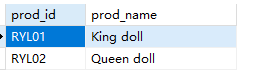
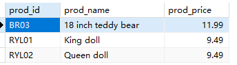
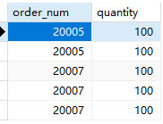
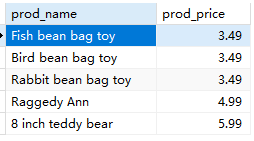

## 4.4 挑战题

1．编写SQL语句，从Products表中检索产品ID（prod_id）和产品名称（prod_name），只返回价格为9.49美元的产品。

```sql
SELECT
	prod_id,
	prod_name 
FROM
	products 
WHERE
	prod_price = '9.49'
```

> 

2．编写SQL语句，从Products表中检索产品ID（prod_id）和产品名称（prod_name），只返回价格为9美元或更高的产品。

```sql
SELECT
	prod_id,
	prod_name,
	prod_price 
FROM
	products 
WHERE
	prod_price >= 9
```

> 

3．结合第3课和第4课编写SQL语句，从OrderItems表中检索出所有不同订单号（order_num），其中包含100个或更多的产品。

```sql
SELECT DISTINCT
	order_num,
	quantity 
FROM
	orderitems 
WHERE
	quantity >= 100
```

> 

4．编写SQL语句，返回Products表中所有价格在3美元到6美元之间的产品的名称（prod_name）和价格（prod_price），然后按价格对结果进行排序。（本题有多种解决方案，我们在下一课再讨论，不过你可以使用目前已学的知识来解决它。

```sql
SELECT
	prod_name,
	prod_price 
FROM
	products 
WHERE
	prod_price BETWEEN 3 AND 6 
ORDER BY
	prod_price
```

> 

