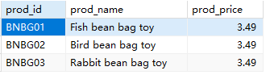
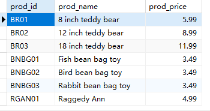
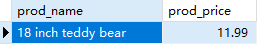

## 5.1 组合WHERE子句

检索由供应商DLL01制造且价格小于等于4美元的所有产品的名称和价格。

```sql
SELECT
	prod_id,
	prod_name,
	prod_price 
FROM
	products 
WHERE
	prod_price < 4 AND vend_id = 'DLL01'
```

>

任一个指定供应商制造的所有产品的产品名和价格。

```sql
SELECT
	prod_id,
	prod_name,
	prod_price 
FROM
	products 
WHERE
	vend_id = 'DLL01' OR vend_id = 'BRS01'
```

> 

```sql
SELECT
	prod_name,
	prod_price 
FROM
	products 
WHERE
	( vend_id = 'DLL01' OR vend_id = 'BRS01' ) AND prod_price >= 10
```

> 


