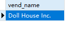
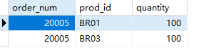
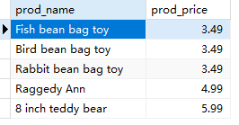

## 5.5 挑战题

1．编写SQL语句，从Vendors表中检索供应商名称（vend_name），仅返回加利福尼亚州的供应商（这需要按国家[USA]和州[CA]进行过滤，没准其他国家也存在一个加利福尼亚州）。提示：过滤器需要匹配字符串。

```sql
SELECT
	vend_name 
FROM
	vendors 
WHERE
	vend_country='USA' and vend_state='CA';
```

> 

2．编写SQL语句，查找所有至少订购了总量100个的BR01、BR02或BR03的订单。你需要返回OrderItems表的订单号（order_num）、产品ID（prod_id）和数量，并按产品ID和数量进行过滤。提示：根据编写过滤器的方式，可能需要特别注意求值顺序。

```sql
SELECT
	order_num,
	prod_id,
	quantity 
FROM
	orderitems 
WHERE
	quantity >= 100 AND prod_id IN ('BR01','BR02','BR03');
```

> 

3．现在，我们回顾上一课的挑战题。编写SQL语句，返回所有价格在3美元到6美元之间的产品的名称（prod_name）和价格（prod_price）。使用AND，然后按价格对结果进行排序。

```sql
SELECT
	prod_name,
	prod_price 
FROM
	products 
WHERE
	prod_price <= 6 AND prod_price >= 3
ORDER BY prod_price
```

> 

4．下面的SQL语句有问题吗？（尝试在不运行的情况下指出。）

```sql
  SELECT vend_name
  FROM Vendors
  ORDER BY vend_name
  WHERE vend_country = 'USA' AND vend_state = 'CA';
```

order by应该放在最后。