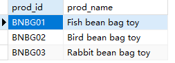

## 6.1 LIKE操作符

百分号（%）通配符

```sql
SELECT
	prod_id,
	prod_name 
FROM
	products 
WHERE
	prod_name LIKE 'Fish%'
```

>

```sql
SELECT
	prod_id,
	prod_name 
FROM
	products 
WHERE
	prod_name LIKE '%bean bag%'
```

下划线（_）通配符

> 

```sql
SELECT
	prod_id,
	prod_name 
FROM
	products 
WHERE
	prod_name LIKE '__ inch teddy bear'
```

> 

```sql
SELECT
	prod_id,
	prod_name 
FROM
	products 
WHERE
	prod_name LIKE '% inch teddy bear'
```

> 

微软的SQL Server支持集合，但是MySQL,Oracle,DB2,SQLite都不支持。就跳过了。