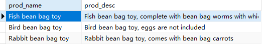
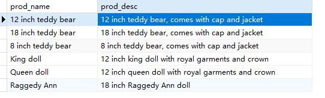
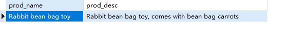
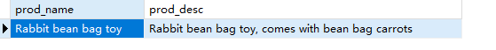

## 6.4 挑战题

1．编写SQL语句，从Products表中检索产品名称（prod_name）和描述（prod_desc），仅返回描述中包含toy一词的产品。

```sql
SELECT
	prod_name,
	prod_desc 
FROM
	products 
WHERE
	prod_desc LIKE '%toy%'
```

> 


2．反过来再来一次。编写SQL语句，从Products表中检索产品名称（prod_name）和描述（prod_desc），仅返回描述中未出现toy一词的产品。这次，按产品名称对结果进行排序。

```sql
SELECT
	prod_name,
	prod_desc 
FROM
	products 
WHERE
	NOT prod_desc LIKE '%toy%'
ORDER BY prod_name
```

> 


3．编写SQL语句，从Products表中检索产品名称（prod_name）和描述（prod_desc），仅返回描述中同时出现toy和carrots的产品。有好几种方法可以执行此操作，但对于这个挑战题，请使用AND和两个LIKE比较。

```sql
SELECT
	prod_name,
	prod_desc 
FROM
	products 
WHERE
	prod_desc LIKE '%toy%' 
	AND prod_desc LIKE '%carrots%'
```

> 

4．来个比较棘手的。我没有特别向你展示这个语法，而是想看看你根据目前已学的知识是否可以找到答案。编写SQL语句，从Products表中检索产品名称（prod_name）和描述（prod_desc），仅返回在描述中以先后顺序同时出现toy和carrots的产品。提示：只需要用带有三个%符号的LIKE即可。

```sql
SELECT
	prod_name,
	prod_desc 
FROM
	products 
WHERE
	prod_desc LIKE '%toy%carrots%'
```

> 