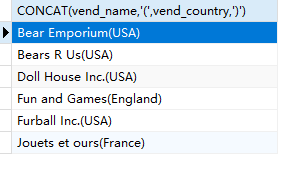
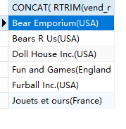
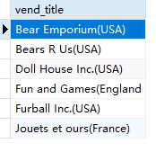

## 7.2 拼接字段

```sql
SELECT
	CONCAT( vend_name, '(', vend_country, ')' ) 
FROM
	vendors 
ORDER BY
	vend_name
```

> 

```sql
SELECT
	CONCAT( RTRIM( vend_name ), '(', RTRIM( vend_country ), ')' ) 
FROM
	vendors 
ORDER BY
	vend_name
```

> 

```sql
SELECT
	CONCAT( RTRIM( vend_name ), '(', RTRIM( vend_country ), ')' ) AS vend_title
FROM
	vendors 
ORDER BY
	vend_name
```

> 
