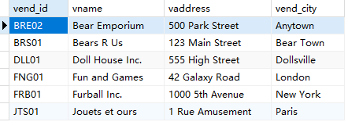
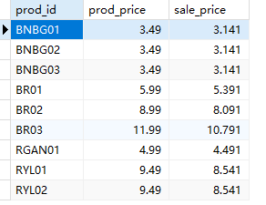

## 7.5 挑战题

1．别名的常见用法是在检索出的结果中重命名表的列字段（为了符合特定的报表要求或客户需求）。编写SQL语句，从Vendors表中检索vend_id、vend_name、vend_address和vend_city，将vend_name重命名为vname，将vend_city重命名为vcity，将vend_address重命名为vaddress。按供应商名称对结果进行排序（可以使用原始名称或新的名称）。

```sql
SELECT
	vend_id,
	vend_name AS vname,
	vend_address AS vaddress,
	vend_city 
FROM
	vendors 
ORDER BY
	vend_name
```

> 

2．我们的示例商店正在进行打折促销，所有产品均降价10%。编写SQL语句，从Products表中返回prod_id、prod_price和sale_price。sale_price是一个包含促销价格的计算字段。提示：可以乘以0.9，得到原价的90%（即10%的折扣）。

```sql
SELECT
	prod_id,
	prod_price,
	prod_price * 0.9 AS sale_price 
FROM
	products
```

> 


