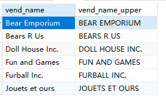
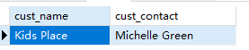
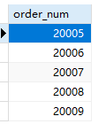

## 8.2 使用函数

```sql
SELECT
	vend_name,
	UPPER( vend_name ) AS vend_name_upper 
FROM
	vendors
```

> 

```sql
SELECT cust_name, cust_contact
FROM
	customers
where SOUNDEX(cust_contact)=SOUNDEX('Michael Green')
```

> 

MySQL中没有`DATEPART`函数，可以用YEAR

```sql
SELECT
	order_num 
FROM
	orders 
WHERE
	YEAR ( order_date )= '2020'
```

> 

