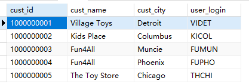
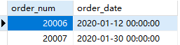

## 8.4 挑战题

1．我们的商店已经上线了，正在创建顾客账户。所有用户都需要登录名，默认登录名是其名称和所在城市的组合。编写SQL语句，返回顾客ID（cust_id）、顾客名称（customer_name）和登录名（user_login），其中登录名全部为大写字母，并由顾客联系人的前两个字符（cust_contact）和其所在城市的前三个字符（cust_city）组成。例如，我的登录名是BEOAK（Ben Forta，居住在Oak Park）。提示：需要使用函数、拼接和别名。

```sql
SELECT
	cust_id,
	cust_name,
	cust_city,
	UPPER(
		CONCAT(
			SUBSTR( cust_name, 1, 2 ),
		SUBSTR( cust_city, 1, 3 ))) AS user_login 
FROM
	customers
```

> 

2．编写SQL语句，返回2020年1月的所有订单的订单号（order_num）和订单日期（order_date），并按订单日期排序。你应该能够根据目前已学的知识来解决此问题，但也可以开卷查阅DBMS文档。

```sql
SELECT
	order_num,
	order_date 
FROM
	orders 
WHERE
	YEAR ( order_date )= '2020' AND MONTH ( order_date )= '1'
```

```sql
SELECT
	order_num,
	order_date 
FROM
	orders 
WHERE
	order_date LIKE '2020-01%'
```

> 


