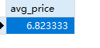
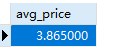
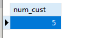
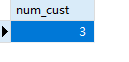
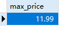
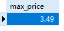
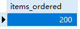
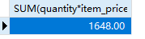

## 9.1 聚集函数

```sql
SELECT
	AVG( prod_price ) AS avg_price 
FROM
	products
```

> 

```sql
SELECT
	AVG( prod_price ) AS avg_price 
FROM
	products 
WHERE
	vend_id = 'DLL01'
```

> 

总数

```sql
SELECT
	count(*) AS num_cust 
FROM
	customers
```

> 

有邮箱的人的总数

```sql
SELECT
	count(cust_email) AS num_cust 
FROM
	customers
```



Products表中最贵物品的价格。

```sql
SELECT
	max( prod_price ) AS max_price 
FROM
	products
```



Products表中最便宜物品的价格。

```sql
SELECT
	MIN( prod_price ) AS max_price 
FROM
	products
```



所订购物品的总数

```sql
SELECT
	SUM( quantity ) AS items_ordered 
FROM
	orderitems 
WHERE
	order_num = 20005;
```

> 

总的订单金额

```sql
SELECT
	SUM( quantity * item_price ) 
FROM
	orderitems 
WHERE
	order_num = 20005;
```

> 

