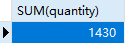
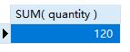
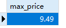

## 9.5 挑战题

1．编写SQL语句，确定已售出产品的总数（使用OrderItems中的quantity列）。

```sql
SELECT
	SUM( quantity ) 
FROM
	orderitems
```

>

2．修改刚刚创建的语句，确定已售出产品项（prod_item）BR01的总数。

```sql
SELECT
	SUM( quantity ) 
FROM
	orderitems 
WHERE
	prod_id = 'BR01'
```

> 

3．编写SQL语句，确定Products表中价格不超过10美元的最贵产品的价格（prod_price）。将计算所得的字段命名为max_price。

```sql
SELECT
	max( prod_price ) AS max_price 
FROM
	products 
WHERE
	prod_price <= 10
```

> 

